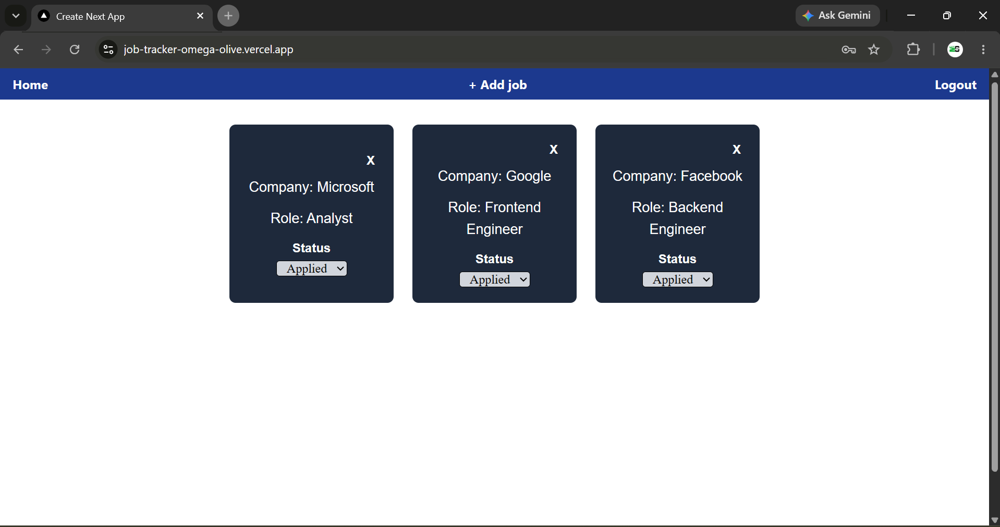

# Job Tracker

A full-stack job application tracker built with Next.js and PostgreSQL.

## Live Demo
[job-tracker-omega-olive.vercel.app](https://job-tracker-omega-olive.vercel.app/login)

## Features
- User registration and login
- Add, update, and delete job applications
- Status tracking (applied, interview, offer, rejected)
- Protected routes — each user only sees their own data

## Tech Stack
- Next.js 15, React, TypeScript
- PostgreSQL, Prisma
- NextAuth v5 (credentials)
- Zod validation
- Tailwind CSS
- Deployed on Vercel

## Local Setup
1. Clone the repo
2. Run `npm install`
3. Create a `.env` file with the variables below
4. Run `npx prisma migrate dev`
5. Run `npm run dev`

## Environment Variables
```env
DATABASE_URL=
AUTH_SECRET=
```

## Preview
